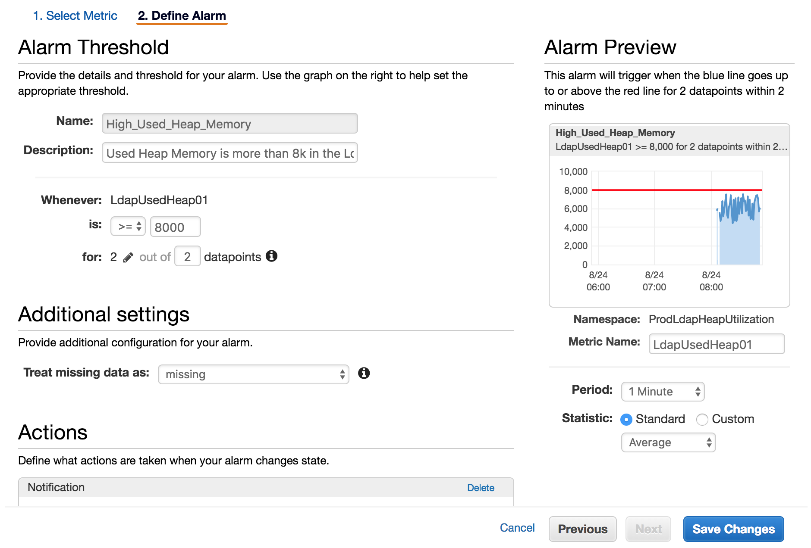

# apacheds_used_heap_to_cloudwatch
The script can be used to put the Utilized Heap Memory of a Java Process as Cloudwatch Metric.

## Setup
- Java Process is running for ApacheDS Service.
- An IAM Role has been attached to the EC2 Server which will allow the server to put metric in Cloudwatch.
- Node v8.11 is installed. 
  - curl --silent --location https://rpm.nodesource.com/setup_8.x | sudo bash -

## Usage
- Clone the Repo.
- Install npm dependencies.
  - npm install aws-sdk child_process
- Ensure jstat tool is installed.
  - yum install java-1.8.0-openjdk-devel
- Execute: node used_heap_to_cloudwatch.js

## Cron
I have scheduled the script using CronJob. The following command can be used in crontab:

### * * * * * node ..../used_heap_to_cloudwatch/used_heap_to_cloudwatch.js >> /var/log/cron_used_heap_to_cloudwatch.log 2>&1
The script will execute every minute and put the used heap memory to the Cloudwatch metric. The names can be modified in the script.

From the AWS Console, an alarm can be configured for the graphed UsedHeap Metric that can be used to get notified if the Java Process is utilising more heap memory.

